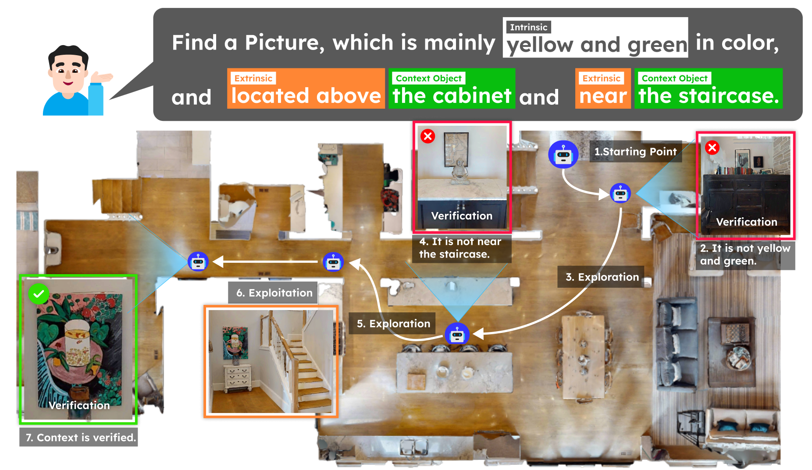

<div align="center">

# Context-Nav: Context-Driven Exploration and Viewpoint-Aware 3D Spatial Reasoning for Instance Navigation

### CVPR 2026

**Won Shik Jang, Ue-Hwan Kim\***  
Gwangju Institute of Science and Technology (GIST)

</div>

<div align="center">

<a href="LINK_TO_PAPER">

</a>

<a href="https://wonshikjang.github.io/ContextNav/">

</a>

<a href="https://arxiv.org/abs/2603.09506">

</a>

</div>

---
<p align="center">
  
</p>

**Context-Nav** is a training-free framework for **Text-Goal Instance Navigation (TGIN)** that leverages long natural-language descriptions to guide exploration and verify object instances via **viewpoint-aware 3D spatial reasoning**.

Instead of relying on early object detections, Context-Nav:

- Converts full natural-language descriptions into **context-driven value maps** for exploration.
- Performs **geometry-grounded spatial verification** for candidate instances.
- Resolves ambiguity among **same-category distractors** using 3D spatial reasoning.

---

## News

- **[2026/04]** Code released!
- **[2026/02]** Context-Nav is accepted to **CVPR 2026** 🎉

---

## Installation

Our setup follows [VLFM](https://github.com/rai-opensource/vlfm). Please refer to their repository for details. Below is a step-by-step summary:

```bash
# 1. Create and activate conda environment
conda create -n ContextNav python=3.9 -y
conda activate ContextNav

# 2. Install CMake and PyTorch
pip install "cmake==3.22.6"
pip install torch==1.12.1+cu113 torchvision==0.13.1+cu113 \
  -f https://download.pytorch.org/whl/torch_stable.html

# 3. Install Habitat-Sim
pip install --no-build-isolation \
  "habitat-sim @ git+https://github.com/facebookresearch/habitat-sim.git@v0.2.4"

# 4. Install GroundingDINO
pip install --no-build-isolation \
  git+https://github.com/IDEA-Research/GroundingDINO.git@eeba084341aaa454ce13cb32fa7fd9282fc73a67

# 5. Clone additional repositories
git clone https://github.com/WongKinYiu/yolov7.git
git clone https://github.com/IDEA-Research/GroundingDINO.git

# 6. Install Context-Nav with Habitat dependencies
pip install -e .[habitat]

# 7. Download spaCy model
python -m spacy download en_core_web_sm

# 8. Install tmux
sudo apt install tmux -y
```

---

## Data & Weights

### 1. HM3D Scene Dataset

You need a Matterport account to download HM3D. Register at [Matterport](https://matterport.com/habitat-matterport-3d-research-dataset) to obtain your credentials.

```bash
export MATTERPORT_TOKEN_ID=<YOUR_TOKEN_ID>
export MATTERPORT_TOKEN_SECRET=<YOUR_TOKEN_SECRET>
export DATA_DIR=data

# Download HM3D 3D scans
python -m habitat_sim.utils.datasets_download \
  --username $MATTERPORT_TOKEN_ID --password $MATTERPORT_TOKEN_SECRET \
  --uids hm3d_train_v0.2 \
  --data-path $DATA_DIR

python -m habitat_sim.utils.datasets_download \
  --username $MATTERPORT_TOKEN_ID --password $MATTERPORT_TOKEN_SECRET \
  --uids hm3d_val_v0.2 \
  --data-path $DATA_DIR

# Download HM3D ObjectNav episodes
wget https://dl.fbaipublicfiles.com/habitat/data/datasets/objectnav/hm3d/v1/objectnav_hm3d_v1.zip
unzip objectnav_hm3d_v1.zip
mkdir -p $DATA_DIR/datasets/objectnav/hm3d
mv objectnav_hm3d_v1 $DATA_DIR/datasets/objectnav/hm3d/v1
rm objectnav_hm3d_v1.zip
```

### 2. InstanceNav (PSL Benchmark)

Follow [PSL-InstanceNav](https://github.com/XinyuSun/PSL-InstanceNav) for details.

```bash
# Download Instance ImageNav dataset
wget https://dl.fbaipublicfiles.com/habitat/data/datasets/imagenav/hm3d/v3/instance_imagenav_hm3d_v3.zip
unzip instance_imagenav_hm3d_v3.zip -d data/datasets/
rm instance_imagenav_hm3d_v3.zip

# Create InstanceNav val split with attribute descriptions
mkdir -p data/datasets/instancenav/val
wget --no-check-certificate \
  "https://drive.google.com/uc?export=download&id=1KNdv6isX1FDZi4KCVPiECYDxijg9cZ3L" \
  -O data/datasets/instancenav/val/val_text.json.gz

# Link episode content
export PROJECT_ROOT=$(pwd)
cd data/datasets/instancenav/val/
ln -s $PROJECT_ROOT/data/datasets/instance_imagenav_hm3d_v3/val/content .
cd $PROJECT_ROOT
```

### 3. CoIN-Bench

Download the CoIN-Bench dataset from [HuggingFace](https://huggingface.co/datasets/ftaioli/CoIN-Bench). Follow the instructions at [CoIN](https://github.com/intelligolabs/CoIN) for details.


### 4. Pre-trained Weights
Most weights follow [VLFM](https://github.com/rai-opensource/vlfm). Download and place them in `data/`:

```bash
cd data

# GroundingDINO weights
wget -q https://github.com/IDEA-Research/GroundingDINO/releases/download/v0.1.0-alpha/groundingdino_swint_ogc.pth

# YOLOv7 weights
wget https://github.com/WongKinYiu/yolov7/releases/download/v0.1/yolov7-e6e.pt

cd ..
```

- **`mobile_sam.pt`**: Download from [MobileSAM](https://github.com/ChaoningZhang/MobileSAM/blob/master/weights/mobile_sam.pt) and place in `data/`.
- **`pointnav_weights.pth`**: Already included in the `data/` subdirectory.
- **`GOAL_ViT_large14_DOCCI.pth`**: Download the **ViT-Large14 Model (DOCCI)** from [GOAL](https://github.com/PerceptualAI-Lab/GOAL) and place in `data/`.

### 5. Data Folder Structure

After downloading everything, organize the `data/` directory as follows:

```
data/
├── datasets/
│   ├── CoIN-Bench/
│   ├── instance_imagenav_hm3d_v3/
│   ├── instancenav/
│   └── objectnav/
├── scene_datasets/
│   └── hm3d/
│       ├── val/
├── GOAL_ViT_large14_DOCCI.pth
├── groundingdino_swint_ogc.pth
├── mobile_sam.pt
├── pointnav_weights.pth
└── yolov7-e6e.pt
```

---

## Evaluation

### 1. Install Ollama & Pull Models

Install [Ollama](https://ollama.com/) and pull the required models (only needed once):

```bash
ollama pull qwen2.5vl:7b-fp16
ollama pull gpt-oss:20b
```

### 2. Launch All Servers

The following script launches all required servers (GroundingDINO, GOAL-CLIP, MobileSAM, YOLOv7, and Ollama) in a single tmux session:

```bash
bash scripts/launch_vlm_servers.sh
```

### 3. Run Evaluation

**CoIN-Bench:**
```bash
CONTEXTNAV_BENCHMARK=coin python -m vlfm.run
```

**InstanceNav (PSL):**
```bash
CONTEXTNAV_BENCHMARK=psl python -m vlfm.run
```

---

## Acknowledgements

This codebase is built upon [VLFM](https://github.com/rai-opensource/vlfm) and [CoIN](https://github.com/intelligolabs/CoIN). We thank the authors for their excellent work.


## Citation

If you find our work useful, please cite:

```bibtex
@inproceedings{jang2026contextnav,
  title={Context-Nav: Context-Driven Exploration and Viewpoint-Aware 3D Spatial Reasoning for Instance Navigation},
  author={Jang, Won Shik and Kim, Ue-Hwan},
  booktitle={Proceedings of the IEEE/CVF Conference on Computer Vision and Pattern Recognition (CVPR)},
  year={2026}
}
```
